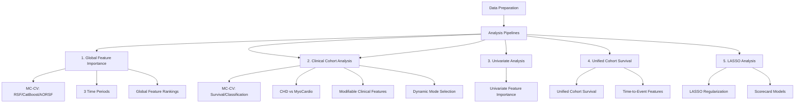

# PHTS Graft Loss Prediction Pipeline

This repository contains a comprehensive analytical pipeline for predicting pediatric heart transplant graft loss using data from the Pediatric Heart Transplant Society (PHTS). The workflow replicates and extends the methodology from Wisotzkey et al. (2023), incorporating multiple survival modeling approaches with robust feature selection and evaluation.

## Overview

The PHTS Graft Loss Prediction Pipeline is a complete end-to-end analytical framework for:
- **Data preprocessing** and feature engineering from PHTS registry data
- **Feature selection** using multiple methods (RSF, CatBoost, AORSF)
- **Survival model fitting** with multiple algorithms
- **Model evaluation** using dual C-index calculations (time-dependent and time-independent)
- **Comprehensive reporting** with tables, figures, and documentation

## Project Structure

```mermaid
graph TB
    ROOT[phts] --> SCRIPTS[scripts/]
    ROOT --> GL[graft-loss]
    ROOT --> CI[concordance_index]
    ROOT --> EDA[eda]
    ROOT --> LMTP[lmtp-workshop]
    ROOT --> DL[survival_analysis_deep_learning_asa]

    SCRIPTS --> SCRIPTS_R[R/ - R scripts]
    SCRIPTS --> SCRIPTS_PY[py/ - Python scripts]
    SCRIPTS --> SCRIPTS_BASH[bash/ - Bash scripts]

    GL --> GL_feat[feature_importance: Global MC-CV]
    GL_feat --> GL_nb[graft_loss_feature_importance_20_MC_CV.ipynb]
    GL_feat --> GL_docs[MC-CV READMEs + outputs]

    GL --> GL_cohort[cohort_analysis: Clinical Cohort Analysis]
    GL_cohort --> GL_cohort_nb[graft_loss_clinical_cohort_analysis.ipynb]
    GL_cohort --> GL_cohort_outputs[cohort outputs (survival + classification)]

    GL --> GL_lasso[lasso: Regularized regression]
    GL --> GL_uni[univariate_analysis]
    GL --> GL_unified[unified_cohort_survival_analysis]
```

**File Organization:**
- **Scripts**: All executable scripts are in `scripts/` organized by language (`R/`, `py/`, `bash/`)
- **Notebooks**: Remain in their respective analysis directories:
  - `graft-loss/feature_importance/` - Global feature importance analysis (MC-CV)
  - `graft-loss/cohort_analysis/` - Clinical cohort analysis with dynamic survival/classification modes (MC-CV)
  - `graft-loss/univariate_analysis/` - Univariate feature importance
  - `graft-loss/unified_cohort_survival_analysis/` - Unified cohort survival analysis
  - `graft-loss/lasso/` - LASSO-based survival models
- **EC2 Compatibility**: Structure matches EC2 file layout for seamless deployment

## Workflow Overview



## Analysis Pipelines Summary

| Pipeline | Location | Type | Methods | Key Features |
|----------|----------|------|---------|--------------|
| **1. Global Feature Importance** | `graft-loss/feature_importance/` | MC-CV Notebook | RSF, CatBoost, AORSF | 3 time periods, 100-1000 splits, global feature rankings |
| **2. Clinical Cohort Analysis** | `graft-loss/cohort_analysis/` | MC-CV Notebook (Dynamic) | **Survival**: RSF, AORSF, CatBoost-Cox, XGBoost-Cox<br>**Classification**: LASSO, CatBoost, CatBoost RF, Traditional RF | CHD vs MyoCardio, modifiable clinical features |
| **3. Univariate Analysis** | `graft-loss/univariate_analysis/` | Analysis | Univariate | Top features univariate importance |
| **4. Unified Cohort Survival** | `graft-loss/unified_cohort_survival_analysis/` | Analysis | Survival models | Unified cohort time-to-event analysis |
| **5. LASSO Analysis** | `graft-loss/lasso/` | Quarto Documents | LASSO | Regularized regression, scorecard models |

## Key Components

### 1. Global Feature Importance Analysis (`graft-loss/feature_importance/`)

Comprehensive Monte Carlo cross-validation feature-importance workflow replicating the original Wisotzkey study and extending it:

- **Notebook:** `graft_loss_feature_importance_20_MC_CV.ipynb`
  - Runs RSF, CatBoost, and AORSF with stratified 75/25 train/test MC-CV splits.
  - Supports 100-split development runs and 1000-split publication-grade runs.
  - Evaluates time-dependent and Harrell C-index on held-out test data.
  - Sources visualization scripts from `scripts/R/create_visualizations.R`

- **Scripts** (in `scripts/R/`):
  - `create_visualizations.R`: Creates feature importance heatmaps and C-index visualizations
  - `check_variables.R`: Validates DONISCH and CPBYPASS variables
  - `check_cpbypass_iqr.R`: Calculates CPBYPASS statistics by period

- **Outputs (`graft-loss/feature_importance/outputs/`):**
  - Top 20 features per method per period (`*_rsf_top20.csv`, `*_catboost_top20.csv`, `*_aorsf_top20.csv`).
  - C-index comparison tables and summary statistics across methods and cohorts.

### 2. Clinical Cohort Analysis (`graft-loss/cohort_analysis/`)

**Dynamic Analysis Pipeline** supporting both survival analysis and event classification with MC-CV:

- **Notebook:** `graft_loss_clinical_cohort_analysis.ipynb`
  - **Mode Selection**: Set `ANALYSIS_MODE <- "survival"` or `"classification"` at top of notebook
  - Defines **two etiologic cohorts**:
    - CHD: `primary_etiology == "Congenital HD"`
    - MyoCardio: `primary_etiology %in% c("Cardiomyopathy", "Myocarditis")`
  - Restricts predictors to a curated set of **modifiable clinical features** (renal, liver, nutrition, respiratory, support devices, immunology).

  **Survival Analysis Mode** (`ANALYSIS_MODE = "survival"`):
  - Runs **within-cohort MC‑CV** (75/25 train/test splits, stratified by outcome) with:
    - RSF (ranger)
    - AORSF
    - CatBoost‑Cox
    - XGBoost‑Cox (boosting)
    - XGBoost‑Cox RF mode (many trees via `num_parallel_tree`)
  - Selects the **best‑C‑index model per cohort** and reports its top clinical features
  - Evaluation: C-index with 95% CI across MC-CV splits

  **Event Classification Mode** (`ANALYSIS_MODE = "classification"`):
  - Runs **within-cohort MC‑CV** (75/25 train/test splits, stratified by outcome) with:
    - LASSO (logistic regression)
    - CatBoost (classification)
    - CatBoost RF (classification)
    - Traditional RF (classification)
  - Target: Binary classification at 1 year (event by 1 year vs no event with follow-up >= 1 year)
  - Evaluation: AUC, Brier Score, Accuracy, Precision, Recall, F1 with 95% CI across MC-CV splits

  - Sources visualization scripts from `scripts/R/create_visualizations_cohort.R`

- **Scripts** (in `scripts/R/`):
  - `create_visualizations_cohort.R`: Creates cohort-specific visualizations including Sankey diagrams
  - `replicate_20_features_MC_CV.R`: Monte Carlo cross-validation script for clinical cohort analysis

- **Outputs (`graft-loss/cohort_analysis/outputs/`):**
  - **Survival Mode**: 
    - `cohort_model_cindex_mc_cv_modifiable_clinical.csv` – C‑index summary per cohort × model
    - `best_clinical_features_by_cohort_mc_cv.csv` – Top modifiable clinical features for the best model in each cohort
  - **Classification Mode**: 
    - `classification_mc_cv/cohort_classification_metrics_mc_cv.csv` – Classification metrics (AUC, Brier, Accuracy, Precision, Recall, F1) per cohort × model
  - `cohort_survival_analysis.qmd`: Survival analysis by cohort
  - `phts_feature_importance.qmd`: Feature importance analysis
  - `workflow_comparison_summary.qmd`: Comparison of different workflow approaches

- **Cohort Analytic Options (COAs)**:
  - **COA1**: Observed-only labels (drops patients censored before 1 year)
  - **COA2**: Observed-only labels restricted to `txpl_year < 2023` (guaranteed 1-year follow-up)
  - **COA3**: IPCW-weighted labels (inverse-probability-of-censoring weighting)

- **Cohorts**: CHD (Congenital HD) vs Myocarditis/Cardiomyopathy
- **Outputs**: Classification summaries, workflow comparisons, FFA rule metrics, Sankey diagrams

- **Scripts** (in `scripts/R/`):
  - `classification_helpers.R`: Helper functions for cohort classification

- **Scripts** (in `scripts/py/`):
  - `ffa_analysis.py`: Fast and Frugal Analysis pipeline
  - `catboost_axp_explainer.py`: CatBoost explainer for FFA
  - `catboost_axp_explainer2.py`: Alternative CatBoost explainer

### 3. Univariate Analysis (`graft-loss/univariate_analysis/`)

Univariate feature importance analysis:

- **Purpose**: Top features univariate analysis
- **Outputs**: `phts_top_features_univariate_analysis.html` - Univariate feature importance results

### 4. Unified Cohort Survival Analysis (`graft-loss/unified_cohort_survival_analysis/`)

Unified cohort survival analysis with time-to-event feature importance:

- **Purpose**: Survival analysis across unified cohorts
- **Outputs**: `sankey_time_to_event_unified_cohort_feature_importance.html` - Sankey diagram of feature importance by cohort

### 5. LASSO Analysis (`graft-loss/lasso/`)

LASSO-based survival analysis and scorecard models:

- **Purpose**: Regularized regression approaches for survival modeling
- **Key Documents**:
  - `lasso_scorecard_model.qmd`: Scorecard model development
  - `survival_analysis_lasso.qmd`: LASSO survival analysis
  - `methods_comparison_README.qmd`: Comparison of LASSO vs other methods

- **Outputs**: Scorecard models, LASSO survival models, method comparisons

### 8. Concordance Index Implementation (`concordance_index/`)

Robust C-index calculation with manual implementation:

- **Time-Dependent C-index**: Matches `riskRegression::Score()` behavior for direct comparison with original study
- **Time-Independent C-index**: Standard Harrell's C-index for general discrimination assessment
- **Documentation**: Comprehensive README explaining methodology, issues, and validation
- **Test Files**: Extensive testing of `riskRegression::Score()` format requirements

### 9. Exploratory Data Analysis (`eda/`)

Initial data exploration and feature importance analysis:

- `phts_eda.qmd`: Exploratory data analysis
- `phts_feature_importance.qmd`: Feature importance across methods

### 6. Parallel Processing Implementation (`graft-loss/graft-loss-parallel-processing/`)

**Development Strategy**: The pipeline is currently running in **unparallelized mode** for verification. Once the unparallelized version is verified, parallel processing implementations will be integrated.

**Current Status**:
- **Active Pipeline** (`graft-loss/scripts/`): Unparallelized mode (for verification)
- **Parallel Processing Code** (`graft-loss/graft-loss-parallel-processing/`): Ready for integration after verification

**Parallelization Strategies** (to be integrated):
- **furrr/future parallelization**: Parallel Monte Carlo CV splits
- **Orchestration-level parallelism**: Multiple dataset cohorts run as separate processes
- **Threading control**: Environment variables prevent CPU oversubscription
- **Parallel utilities**: Centralized configuration (`R/utils/parallel_utils.R`)

**See `PARALLEL_PROCESSING.md` for comprehensive documentation.**

## Pipeline Stages

### Stage 1: Environment Setup

- **`scripts/00_setup.R`**: Initializes project, loads libraries, sets global options
- **`scripts/packages.R`**: Package management and installation
- **`R/config.R`**: Centralized configuration system

### Stage 2: Data Preparation

- **`scripts/01_prepare_data.R`**: Cleans and preprocesses raw PHTS data
- **`R/clean_phts.R`**: Data cleaning functions
- **`R/make_final_features.R`**: Feature engineering
- **`R/make_labels.R`**: Survival outcome labeling

**Data Source**: `phts_txpl_ml.sas7bdat`
- **File**: `data/phts_txpl_ml.sas7bdat` (matches original study)
- **Censoring Implementation**: The original study's `clean_phts()` function includes proper censoring handling:
  - Sets event times of 0 to 1/365 (prevents invalid zero times for survival analysis)
  - Properly maintains censored observations (status = 0) throughout the analysis
  - Ensures consistent survival structure matching the original Wisotzkey study
- **Why this file**: The original study used `phts_txpl_ml.sas7bdat` specifically because it includes the censoring implementation needed for accurate survival modeling

**Data Coverage**: 2010-2024 (TXPL_YEAR)

**Filtering Options**:
- `EXCLUDE_COVID=1`: Excludes 2020-2023 (approximate COVID period)
- `ORIGINAL_STUDY=1`: Restricts to 2010-2019 (original study period)

**Variable Processing** (applied before modeling):
- **CPBYPASS (Cardiopulmonary Bypass Time)**: Summary statistics are calculated (median, IQR, non-missing counts), then the variable is **removed from the dataset** and excluded from all modeling analyses
- **DONISCH (Donor Ischemic Time)**: Converted from continuous variable (minutes) to **dichotomous variable**:
  - `donisch = 1` if donor ischemic time > 4 hours (>240 minutes)
  - `donisch = 0` if donor ischemic time ≤ 4 hours (≤240 minutes)
  - Variable name remains `donisch` (now binary: 0/1 instead of continuous minutes)
  - This transformation is applied before defining time periods and running all analyses

**Note**: The dichotomous `donisch` variable (not CPBYPASS) will appear in feature importance results.

### Stage 3: Resampling and Cross-Validation

- **`scripts/02_resampling.R`**: Sets up Monte Carlo cross-validation splits
- **`R/mc_cv_light.R`**: Multi-core CV implementation
- **`R/reuse_resamples.R`**: Split reuse across scenarios

**Monte Carlo CV**:
- Enable with `MC_CV=1`
- Control splits: `MC_MAX_SPLITS=1000`, `MC_START_AT=1`
- Split reuse: `REUSE_BASE_SPLITS=1` for paired comparisons

### Stage 4: Model Data Preparation

- **`scripts/03_prep_model_data.R`**: Prepares data for modeling
- **`R/make_recipe.R`**: Creates preprocessing recipes
- **`R/make_recipe_interpretable.R`**: Interpretable recipe variants

**Dual Data Paths**:
- **Native categoricals**: `final_data_catboost.rds` (for CatBoost, AORSF)
- **Encoded**: `final_data_encoded.rds` (encoded/dummy-coded variant; used by historical pipelines)

### Stage 5: Model Fitting

- **`scripts/04_fit_model.R`**: Fits multiple survival models (legacy pipeline)
- **`R/fit_rsf.R`**: Random Survival Forest (ranger)
- **`R/fit_orsf.R`**: Oblique Random Survival Forest (aorsf)

**Models Available (current MC-CV workflow):**
- **RSF**: Random Survival Forest with permutation importance
- **AORSF**: Accelerated Oblique Random Survival Forest (matches original study)
- **CatBoost**: Gradient boosting with native categorical handling

**Model Selection**: Standardized heuristic based on C-index, stability, and interpretability

### Stage 6: Model Evaluation

- **`scripts/05_generate_outputs.R`**: Generates performance metrics and visualizations
- **`R/fit_evaluation.R`**: Model evaluation functions
- **`R/GND_calibration.R`**: Calibration assessment
- **`R/visualize_*.R`**: Visualization functions

**Evaluation Metrics**:
- **Time-Dependent C-index**: At 1-year horizon (matches original study)
- **Time-Independent C-index**: Harrell's C-index (general discrimination)
- **Calibration**: Gronnesby-Borgan test
- **Feature Importance**: Multiple methods (permutation, negate, gain-based)

## Feature Selection Methods

### Workflow Alignment with Original Repository

Our feature selection workflow **matches the original repository** ([bcjaeger/graft-loss](https://github.com/bcjaeger/graft-loss)):

1. **Feature Selection from ALL Variables**: Uses all available variables (not pre-filtered to Wisotzkey variables)
2. **Recipe Preprocessing**: Applies `make_recipe()` → `prep()` → `juice()` with median/mode imputation
3. **Top 20 Selection**: Selects top 20 features using permutation importance (RSF) or feature importance (CatBoost, AORSF)
4. **Wisotzkey Identification**: After selecting top 20, identifies which of those features are Wisotzkey variables (15 core variables from original study)

This workflow ensures:
- **Unbiased feature selection**: Not constrained to pre-defined variable set
- **Reproducibility**: Matches original study methodology exactly
- **Transparency**: Clear identification of Wisotzkey overlap in selected features

**Key Implementation Details**:
- **Data Source**: Uses `phts_txpl_ml.sas7bdat` (matches original study) with proper censoring implementation
- **Censoring Handling**: Event times of 0 are set to 1/365 to prevent invalid survival times
- Excludes outcome/leakage variables (`int_dead`, `int_death`, `graft_loss`, `txgloss`, `death`, `event`)
- Uses `dummy_code = FALSE` for recipe preprocessing (preserves categorical structure)
- Applies same RSF parameters as original: `num.trees = 500`, `importance = 'permutation'`, `splitrule = 'extratrees'`

### RSF Permutation Importance

- **Method**: Random Survival Forest with permutation importance
- **Parameters**: `num.trees = 500`, `importance = 'permutation'`, `splitrule = 'extratrees'`, `num.random.splits = 10`, `min.node.size = 20`
- **Use**: Matches original Wisotzkey study methodology and repository implementation
- **Output**: Top 20 features ranked by permutation importance

### CatBoost Feature Importance

- **Method**: CatBoost gradient boosting with signed-time labels
- **Parameters**: `iterations = 2000`, `depth = 6`, `learning_rate = 0.05`
- **Use**: Captures non-linear relationships and interactions
- **Output**: Top 20 features ranked by gain-based importance

### AORSF Feature Importance

- **Method**: Accelerated Oblique Random Survival Forest (negate method)
- **Parameters**: `n_tree = 100`, `na_action = 'impute_meanmode'`
- **Use**: Matches original study's final model approach
- **Output**: Top 20 features ranked by negate importance

## C-index Calculation

### Dual Implementation

The pipeline calculates **both** time-dependent and time-independent C-indexes for comprehensive evaluation:

#### Time-Dependent C-index

- **Method**: Matches `riskRegression::Score()` behavior
- **Evaluation**: At specific time horizon (default: 1 year)
- **Logic**: Compares patients with events before horizon vs patients at risk at horizon
- **Use**: Direct comparison with original study (~0.74)

#### Time-Independent C-index (Harrell's C)

- **Method**: Standard Harrell's C-index formula
- **Evaluation**: Uses all comparable pairs regardless of time
- **Logic**: Pairwise comparisons where one patient has event and another has later time
- **Use**: General measure of discrimination across entire follow-up

### Implementation Details

- **Primary**: Attempts `riskRegression::Score()` for time-dependent (matching original study)
- **Fallback**: Manual calculation if `Score()` fails
- **Always Calculates**: Time-independent C-index using manual Harrell's C
- **Consistency**: All three methods (RSF, CatBoost, AORSF) use same approach

See `concordance_index/concordance_index_README.md` for detailed documentation.

## Time Period Analysis

The pipeline supports analysis across multiple time periods:

### Original Study Period (2010-2019)

- **Set**: `ORIGINAL_STUDY=1`
- **Matches**: Original Wisotzkey et al. (2023) publication
- **Use**: Direct replication and comparison

### Full Study Period (2010-2024)

- **Default**: All available data
- **Use**: Maximum sample size and contemporary analysis

### COVID-Excluded Period (2010-2024 excluding 2020-2023)

- **Set**: `EXCLUDE_COVID=1`
- **Use**: Sensitivity analysis excluding COVID-affected years

## Quick Start

### Basic Pipeline Run

```bash
"/c/Program Files/R/R-4.5.1/bin/Rscript.exe" graft-loss/scripts/run_pipeline.R
```

### Original Study Period

```bash
ORIGINAL_STUDY=1 "/c/Program Files/R/R-4.5.1/bin/Rscript.exe" graft-loss/scripts/run_pipeline.R
```

### Monte Carlo Cross-Validation

```bash
MC_CV=1 MC_MAX_SPLITS=1000 USE_CATBOOST=1 \
"/c/Program Files/R/R-4.5.1/bin/Rscript.exe" graft-loss/scripts/run_pipeline.R
```

### Feature Importance Replication

```r
# From R console or RStudio
source("graft-loss/feature_importance/replicate_20_features.R")
```

This runs RSF, CatBoost, and AORSF feature selection across all three time periods and generates comprehensive comparison tables.

## Output Structure

### Model Artifacts (`graft-loss/data/models/`)

- `model_orsf.rds`, `model_rsf.rds`, `model_xgb.rds`: Fitted models
- `model_comparison_index.csv`: Model metadata and data variants
- `model_mc_metrics_*.csv`: Monte Carlo CV metrics per split
- `model_mc_summary_*.csv`: Aggregated MC CV summaries
- `model_mc_importance_*.csv`: Feature importance across splits
- `final_model_choice.csv`: Selected model with rationale

### Feature Importance Outputs

**Global Feature Importance** (`graft-loss/feature_importance/outputs/`):
- `*_rsf_top20.csv`: RSF top 20 features (with both C-index types)
- `*_catboost_top20.csv`: CatBoost top 20 features (with both C-index types)
- `*_aorsf_top20.csv`: AORSF top 20 features (with both C-index types)
- `cindex_comparison_mc_cv.csv`: Combined C-index comparison
- `summary_statistics_mc_cv.csv`: Sample sizes, event rates, C-indexes
- `plots/feature_importance_heatmap.png`: Feature importance heatmap
- `plots/cindex_heatmap.png`: C-index heatmap
- `plots/scaled_feature_importance_bar_chart.png`: Scaled feature importance bar chart
- `plots/cindex_table.csv`: C-index table with confidence intervals

**Clinical Cohort Analysis** (`graft-loss/cohort_analysis/outputs/`):
- **Survival Mode**:
  - `cohort_model_cindex_mc_cv_modifiable_clinical.csv`: C-index summary per cohort × model
  - `best_clinical_features_by_cohort_mc_cv.csv`: Top modifiable clinical features per cohort
  - `plots/cohort_clinical_feature_sankey.html`: Sankey diagram of cohort → clinical features
- **Classification Mode**:
  - `classification_mc_cv/cohort_classification_metrics_mc_cv.csv`: Classification metrics (AUC, Brier, Accuracy, Precision, Recall, F1) per cohort × model

**Univariate Analysis** (`graft-loss/univariate_analysis/`):
- `phts_top_features_univariate_analysis.html`: Univariate feature importance

**Unified Cohort Survival** (`graft-loss/unified_cohort_survival_analysis/`):
- `sankey_time_to_event_unified_cohort_feature_importance.html`: Time-to-event feature importance Sankey

### Documentation (`graft-loss/doc/`)

- `predicting_graft_loss.Rmd`: Main manuscript/report
- `jacc.csl`, `refs.bib`: Citation style and bibliography

## Key Features

### Robust C-index Calculation

- **Dual Implementation**: Both time-dependent and time-independent
- **Reliable Fallback**: Manual calculation when `riskRegression::Score()` fails
- **Comprehensive Documentation**: See `concordance_index/concordance_index_README.md`

### Multiple Feature Selection Methods

- **RSF**: Permutation importance (original study method)
- **CatBoost**: Gain-based importance
- **AORSF**: Negate importance (original study's final model)

### Comprehensive Model Comparison

- **Multiple Algorithms**: RSF, AORSF, CatBoost
- **Multiple Time Periods**: Original study, full period, COVID-excluded
- **Multiple Metrics**: Time-dependent and time-independent C-indexes

### Reproducible Workflow

- **Environment Variables**: Control all aspects via flags
- **Logging**: Comprehensive pipeline logs with timestamps
- **Progress Tracking**: JSON progress file for monitoring
- **Split Reuse**: Paired comparisons across scenarios

### Parallel Processing

- **Multiple Strategies**: furrr/future, orchestration-level, and threading control
- **Auto-Configuration**: Automatic worker detection and backend selection
- **Resource Management**: Prevents CPU oversubscription via environment variables
- **EC2-Compatible**: Robust core detection and backend fallbacks for cloud environments

**See `PARALLEL_PROCESSING.md` for detailed documentation.**

## Environment Variables

### Data Filtering

- `EXCLUDE_COVID=1`: Exclude 2020-2023
- `ORIGINAL_STUDY=1`: Restrict to 2010-2019

### Model Selection

- `USE_CATBOOST=1`: Include CatBoost in analysis
- `USE_ENCODED=1`: Use encoded (dummy-coded) data variant
- `CATBOOST_USE_FULL=1`: CatBoost uses all features (default)
- `ORSF_FULL=1`: ORSF uses all features

### Monte Carlo CV

- `MC_CV=1`: Enable Monte Carlo cross-validation
- `MC_MAX_SPLITS=1000`: Maximum number of splits
- `MC_START_AT=1`: Starting split index (for resuming)
- `REUSE_BASE_SPLITS=1`: Reuse splits across scenarios
- `MC_SPLIT_WORKERS`: Number of workers for parallel CV splits (auto-detected if not set)
- `MC_WORKER_THREADS`: Threads per worker for BLAS/OpenMP (default: 1)

**See `PARALLEL_PROCESSING.md` for detailed parallel processing documentation.**

### Scenarios

- `SCENARIO=original_study_fullcats`: Original period + full CatBoost features
- `SCENARIO=covid_exclusion_full`: Exclude COVID + full CatBoost
- `SCENARIO=full_all_full`: Full dataset + all models full features

## Recent Updates

### Project Reorganization

- **Scripts Directory**: All executable scripts now organized in `scripts/` by language:
  - `scripts/R/`: R scripts (visualizations, helpers, analysis)
  - `scripts/py/`: Python scripts (FFA analysis, explainers)
  - `scripts/bash/`: Bash scripts (automation)
- **EC2 Compatibility**: File structure matches EC2 layout for seamless deployment
- **Feature Importance**: Moved to `graft-loss/feature_importance/`
- **Concordance Index**: New `concordance_index/` directory with documentation
- **EDA**: Organized into `eda/` directory
- **LASSO**: Organized into `lasso/` directory

### Enhanced Feature Selection

- **Added AORSF**: Now includes AORSF alongside RSF and CatBoost
- **Dual C-index**: Both time-dependent and time-independent calculations
- **Comprehensive Comparison**: Across three methods and three time periods

### Improved Documentation

- **Feature Importance README**: Comprehensive guide for `replicate_20_features.R`
- **Concordance Index README**: Detailed explanation of C-index implementation
- **Parallel Processing Documentation**: Complete guide to parallelization strategies (`PARALLEL_PROCESSING.md`)
- **Updated Pipeline README**: Reflects latest structure and capabilities

## Requirements

- **R**: Version 4.5.1 or higher
- **R Packages**: See `graft-loss/scripts/packages.R` for complete list
- **Python** (optional): For CatBoost integration (`python`, `catboost`, `pandas`, `numpy`)
- **Data**: PHTS registry data files (contact repository maintainer for access)

## References

- Wisotzkey et al. (2023). Risk factors for 1-year allograft loss in pediatric heart transplant. *Pediatric Transplantation*.

## Contact

For questions or issues, please refer to the documentation in each component directory or review the inline code comments.

---

**Note**: The pipeline is modular; each script can be run independently or as part of the full workflow. For detailed usage, refer to the README files in each component directory and the inline comments within scripts.

