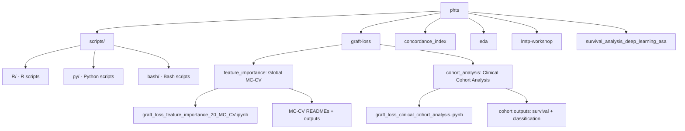
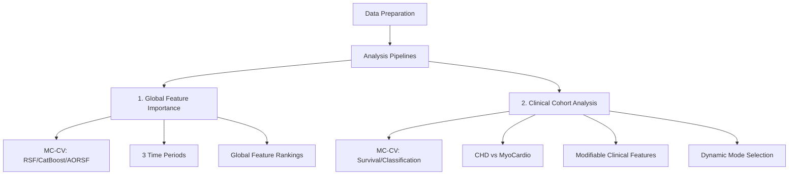

# PHTS Graft Loss Prediction Pipeline

This repository contains a comprehensive analytical pipeline for predicting pediatric heart transplant graft loss using data from the Pediatric Heart Transplant Society (PHTS). The workflow replicates and extends the methodology from Wisotzkey et al. (2023), incorporating multiple survival modeling approaches with robust feature selection and evaluation.

## Overview

The PHTS Graft Loss Prediction Pipeline is a complete end-to-end analytical framework for:
- **Data preprocessing** and feature engineering from PHTS registry data
- **Feature selection** using multiple methods (RSF, CatBoost, AORSF)
- **Survival model fitting** with multiple algorithms
- **Model evaluation** using dual C-index calculations (time-dependent and time-independent)
- **Comprehensive reporting** with tables, figures, and documentation

## Project Structure

**File Organization:**
- **Scripts**: All executable scripts are in `scripts/` organized by language (`R/`, `py/`, `bash/`)
- **Notebooks**: Remain in their respective analysis directories:
  - `graft-loss/feature_importance/` - Global feature importance analysis (MC-CV)
  - `graft-loss/cohort_analysis/` - Clinical cohort analysis with dynamic survival/classification modes (MC-CV)
- **Documentation**: Centralized in `docs/` folder, with root READMEs in each workflow directory
- **EC2 Compatibility**: Structure matches EC2 file layout for seamless deployment

## Workflow Overview

## Analysis Pipelines Summary

| Pipeline | Location | Type | Methods | Key Features |
|----------|----------|------|---------|--------------|
| **1. Global Feature Importance** | `graft-loss/feature_importance/` | MC-CV Notebook | RSF, CatBoost, AORSF | 3 time periods, 100-1000 splits, global feature rankings |
| **2. Clinical Cohort Analysis** | `graft-loss/cohort_analysis/` | MC-CV Notebook (Dynamic) | **Survival**: RSF, AORSF, CatBoost-Cox, XGBoost-Cox **Classification**: CatBoost, CatBoost RF, Traditional RF, XGBoost, XGBoost RF | CHD vs MyoCardio, modifiable clinical features |

## Key Components

### 1. Global Feature Importance Analysis (`graft-loss/feature_importance/`)

Comprehensive Monte Carlo cross-validation feature-importance workflow replicating the original Wisotzkey study and extending it:

- **Notebook:** `graft_loss_feature_importance_20_MC_CV.ipynb`
  - Runs RSF, CatBoost, and AORSF with stratified 75/25 train/test MC-CV splits.
  - Supports 100-split development runs and 1000-split publication-grade runs.
  - Analyzes three time periods: Original (2010-2019), Full (2010-2024), Full No COVID (2010-2024 excluding 2020-2023).
  - Extracts top 20 features per method per period.
  - Calculates C-index with 95% CI across MC-CV splits.

- **Scripts** (in `scripts/R/`):
  - `create_visualizations.R`: Creates feature importance heatmaps, C-index heatmaps, and bar charts
  - `replicate_20_features_MC_CV.R`: Monte Carlo cross-validation script
  - `check_variables.R`: Variable validation
  - `check_cpbypass_iqr.R`: CPBYPASS statistics

- **Outputs (`graft-loss/feature_importance/outputs/`):**
  - `plots/` - Feature importance visualizations
  - `cindex_table.csv` - C-index table with confidence intervals
  - `top_20_features_*.csv` - Top 20 features per method and period

- **Documentation:**
  - See `graft-loss/feature_importance/README.md` for quick start
  - Detailed docs in `docs/feature_importance/`

### 2. Clinical Cohort Analysis (`graft-loss/cohort_analysis/`)

**Dynamic Analysis Pipeline** supporting both survival analysis and event classification with MC-CV:

- **Notebook:** `graft_loss_clinical_cohort_analysis.ipynb`
  - **Mode Selection**: Set `ANALYSIS_MODE <- "survival"` or `"classification"` at top of notebook
  - Defines **two etiologic cohorts**:
    - CHD: `primary_etiology == "Congenital HD"`
    - MyoCardio: `primary_etiology %in% c("Cardiomyopathy", "Myocarditis")`
  - Restricts predictors to a curated set of **modifiable clinical features** (renal, liver, nutrition, respiratory, support devices, immunology).

  **Survival Analysis Mode** (`ANALYSIS_MODE = "survival"`):
  - Runs **within-cohort MC‑CV** (75/25 train/test splits, stratified by outcome) with:
    - RSF (ranger)
    - AORSF
    - CatBoost‑Cox
    - XGBoost‑Cox (boosting)
    - XGBoost‑Cox RF mode (many trees via `num_parallel_tree`)
  - Selects the **best‑C‑index model per cohort** and reports its top clinical features
  - Evaluation: C-index with 95% CI across MC-CV splits

  **Event Classification Mode** (`ANALYSIS_MODE = "classification"`):
  - Runs **within-cohort MC‑CV** (75/25 train/test splits, stratified by outcome) with:
    - CatBoost (classification)
    - CatBoost RF (classification)
    - Traditional RF (classification)
    - XGBoost (classification)
    - XGBoost RF (classification)
  - Target: Binary classification at 1 year (event by 1 year vs no event with follow-up >= 1 year)
  - Evaluation: AUC, Brier Score, Accuracy, Precision, Recall, F1 with 95% CI across MC-CV splits

  - Sources visualization scripts from `scripts/R/create_visualizations_cohort.R`

- **Scripts** (in `scripts/R/`):
  - `create_visualizations_cohort.R`: Creates cohort-specific visualizations including Sankey diagrams
  - `classification_helpers.R`: Helper functions for classification analysis

- **Outputs (`graft-loss/cohort_analysis/outputs/`):**
  - **Survival Mode**: 
    - `cohort_model_cindex_mc_cv_modifiable_clinical.csv` – C‑index summary per cohort × model
    - `best_clinical_features_by_cohort_mc_cv.csv` – Top modifiable clinical features for the best model in each cohort
    - `plots/` - Visualizations (heatmaps, bar charts, Sankey diagrams)
  - **Classification Mode**: 
    - `classification_mc_cv/cohort_classification_metrics_mc_cv.csv` – Classification metrics (AUC, Brier, Accuracy, Precision, Recall, F1) per cohort × model

- **Documentation:**
  - See `graft-loss/cohort_analysis/README.md` for quick start
  - Detailed docs in `docs/cohort_analysis/`

### 3. Concordance Index Implementation (`concordance_index/`)

Robust C-index calculation with manual implementation:

- **Time-Dependent C-index**: Matches `riskRegression::Score()` behavior for direct comparison with original study
- **Time-Independent C-index**: Standard Harrell's C-index for general discrimination assessment
- **Documentation**: Comprehensive README explaining methodology, issues, and validation
- **Test Files**: Extensive testing of `riskRegression::Score()` format requirements

## Pipeline Stages

### Stage 1: Environment Setup

- **`scripts/R/`**: Helper functions and utilities
- **`scripts/py/`**: Python scripts for specialized analyses (e.g., FFA)
- **`scripts/bash/`**: Bash scripts for automation

### Stage 2: Data Preparation

- **Data Source**: `graft-loss/data/phts_txpl_ml.sas7bdat` (matches original study)
- **Censoring Implementation**: The original study's censoring handling:
  - Sets event times of 0 to 1/365 (prevents invalid zero times for survival analysis)
  - Properly maintains censored observations (status = 0) throughout the analysis
  - Ensures consistent survival structure matching the original Wisotzkey study

**Data Coverage**: 2010-2024 (TXPL_YEAR)

**Filtering Options**:
- `EXCLUDE_COVID=1`: Excludes 2020-2023 (approximate COVID period)
- `ORIGINAL_STUDY=1`: Restricts to 2010-2019 (original study period)

**Variable Processing** (applied before modeling):
- **CPBYPASS**: Removed (not available in all time periods, high missingness)
- **DONISCH**: Dichotomized (>4 hours = 1, ≤4 hours = 0) for consistency

### Stage 3: Feature Selection

- **RSF Permutation Importance**: Matches original Wisotzkey study methodology
- **CatBoost Feature Importance**: Captures non-linear relationships
- **AORSF Feature Importance**: Matches original study's final model approach
- **Top 20 Selection**: Selects top 20 features per method per period

### Stage 4: Model Fitting

**Survival Models:**
- **RSF**: Random Survival Forest with permutation importance
- **AORSF**: Accelerated Oblique Random Survival Forest (matches original study)
- **CatBoost-Cox**: Gradient boosting with Cox loss
- **XGBoost-Cox**: Gradient boosting with Cox loss (boosting and RF modes)

**Classification Models:**
- **CatBoost**: Gradient boosting classification
- **CatBoost RF**: CatBoost configured as Random Forest
- **Traditional RF**: Classic Random Forest classification
- **XGBoost**: Gradient boosting classification
- **XGBoost RF**: XGBoost configured as Random Forest

### Stage 5: Model Evaluation

**Evaluation Metrics**:
- **Time-Dependent C-index**: At 1-year horizon (matches original study)
- **Time-Independent C-index**: Harrell's C-index (general discrimination)
- **Classification Metrics**: AUC, Brier Score, Accuracy, Precision, Recall, F1
- **Calibration**: Gronnesby-Borgan test (survival)
- **Feature Importance**: Multiple methods (permutation, negate, gain-based)

## Feature Selection Methods

### Workflow Alignment with Original Repository

Our feature selection workflow **matches the original repository** ([bcjaeger/graft-loss](https://github.com/bcjaeger/graft-loss)):

1. **Feature Selection from ALL Variables**: Uses all available variables (not pre-filtered to Wisotzkey variables)
2. **Recipe Preprocessing**: Applies `make_recipe()` → `prep()` → `juice()` with median/mode imputation
3. **Top 20 Selection**: Selects top 20 features using permutation importance (RSF) or feature importance (CatBoost, AORSF)
4. **Wisotzkey Identification**: After selecting top 20, identifies which of those features are Wisotzkey variables (15 core variables from original study)

This workflow ensures:
- **Unbiased feature selection**: Not constrained to pre-defined variable set
- **Reproducibility**: Matches original study methodology exactly
- **Transparency**: Clear identification of Wisotzkey overlap in selected features

**Key Implementation Details**:
- **Data Source**: Uses `phts_txpl_ml.sas7bdat` (matches original study) with proper censoring implementation
- **Censoring Handling**: Event times of 0 are set to 1/365 to prevent invalid survival times
- Excludes outcome/leakage variables (`int_dead`, `int_death`, `graft_loss`, `txgloss`, `death`, `event`)
- Uses `dummy_code = FALSE` for recipe preprocessing (preserves categorical structure)
- Applies same RSF parameters as original: `num.trees = 500`, `importance = 'permutation'`, `splitrule = 'extratrees'`

### RSF Permutation Importance

- **Method**: Random Survival Forest with permutation importance
- **Parameters**: `num.trees = 500`, `importance = 'permutation'`, `splitrule = 'extratrees'`, `num.random.splits = 10`, `min.node.size = 20`
- **Use**: Matches original Wisotzkey study methodology and repository implementation
- **Output**: Top 20 features ranked by permutation importance

### CatBoost Feature Importance

- **Method**: CatBoost gradient boosting with signed-time labels
- **Parameters**: `iterations = 2000`, `depth = 6`, `learning_rate = 0.05`
- **Use**: Captures non-linear relationships and interactions
- **Output**: Top 20 features ranked by gain-based importance

### AORSF Feature Importance

- **Method**: Accelerated Oblique Random Survival Forest (negate method)
- **Parameters**: `n_tree = 100`, `na_action = 'impute_meanmode'`
- **Use**: Matches original study's final model approach
- **Output**: Top 20 features ranked by negate importance

## C-index Calculation

### Dual Implementation

The pipeline calculates **both** time-dependent and time-independent C-indexes for comprehensive evaluation:

#### Time-Dependent C-index

- **Method**: Matches `riskRegression::Score()` behavior
- **Evaluation**: At specific time horizon (default: 1 year)
- **Logic**: Compares patients with events before horizon vs patients at risk at horizon
- **Use**: Direct comparison with original study (~0.74)

#### Time-Independent C-index (Harrell's C)

- **Method**: Standard Harrell's C-index formula
- **Evaluation**: Uses all comparable pairs regardless of time
- **Logic**: Pairwise comparisons where one patient has event and another has later time
- **Use**: General measure of discrimination across entire follow-up

### Implementation Details

- **Primary**: Attempts `riskRegression::Score()` for time-dependent (matching original study)
- **Fallback**: Manual calculation if `Score()` fails
- **Always Calculates**: Time-independent C-index using manual Harrell's C
- **Consistency**: All three methods (RSF, CatBoost, AORSF) use same approach

See `concordance_index/concordance_index_README.md` for detailed documentation.

## Time Period Analysis

The pipeline supports analysis across multiple time periods:

### Original Study Period (2010-2019)

- **Set**: `ORIGINAL_STUDY=1`
- **Matches**: Original Wisotzkey et al. (2023) publication
- **Use**: Direct replication and comparison

### Full Study Period (2010-2024)

- **Default**: All available data
- **Use**: Maximum sample size and contemporary analysis

### COVID-Excluded Period (2010-2024 excluding 2020-2023)

- **Set**: `EXCLUDE_COVID=1`
- **Use**: Sensitivity analysis excluding COVID-affected years

## Quick Start

### Global Feature Importance

1. Navigate to `graft-loss/feature_importance/`
2. Open `graft_loss_feature_importance_20_MC_CV.ipynb`
3. Set `DEBUG_MODE <- FALSE` for full analysis
4. Set `n_mc_splits <- 100` for development or `1000` for publication
5. Run notebook from top to bottom
6. Results saved to `outputs/` directory

### Clinical Cohort Analysis

1. Navigate to `graft-loss/cohort_analysis/`
2. Open `graft_loss_clinical_cohort_analysis.ipynb`
3. Set `ANALYSIS_MODE <- "survival"` or `"classification"`
4. Set `DEBUG_MODE <- FALSE` for full analysis
5. Run notebook from top to bottom
6. Results saved to `outputs/` directory

## Output Structure

### Global Feature Importance (`graft-loss/feature_importance/outputs/`)

- `plots/` - Feature importance visualizations
- `cindex_table.csv` - C-index table with confidence intervals
- `top_20_features_*.csv` - Top 20 features per method and period

### Clinical Cohort Analysis (`graft-loss/cohort_analysis/outputs/`)

- **Survival Mode**:
  - `cohort_model_cindex_mc_cv_modifiable_clinical.csv` - C-index summary per cohort × model
  - `best_clinical_features_by_cohort_mc_cv.csv` - Top modifiable clinical features per cohort
  - `plots/cohort_clinical_feature_sankey.html` - Sankey diagram of cohort → clinical features
- **Classification Mode**:
  - `classification_mc_cv/cohort_classification_metrics_mc_cv.csv` - Classification metrics (AUC, Brier, Accuracy, Precision, Recall, F1) per cohort × model

### Documentation (`docs/`)

- **Centralized Documentation**: All detailed documentation in `docs/` folder
- **Workflow-Specific**: Root READMEs in each workflow directory
- **Shared Documentation**: Common topics in `docs/shared/`
- **Standards**: Scripts standards in `docs/scripts/`

## Key Features

### Robust C-index Calculation

- **Dual Implementation**: Both time-dependent and time-independent
- **Reliable Fallback**: Manual calculation when `riskRegression::Score()` fails
- **Comprehensive Documentation**: See `concordance_index/concordance_index_README.md`

### Multiple Feature Selection Methods

- **RSF**: Permutation importance (original study method)
- **CatBoost**: Gain-based importance
- **AORSF**: Negate importance (original study's final model)

### Comprehensive Model Comparison

- **Multiple Algorithms**: RSF, AORSF, CatBoost, XGBoost, Cox PH (survival); CatBoost, CatBoost RF, Traditional RF, XGBoost, XGBoost RF (classification)
- **Multiple Time Periods**: Original study, full period, COVID-excluded
- **Multiple Metrics**: Time-dependent and time-independent C-indexes; AUC, Brier, Accuracy, Precision, Recall, F1

### Reproducible Workflow

- **Monte Carlo Cross-Validation**: Robust evaluation with many train/test splits
- **Stratified Sampling**: Maintains event distribution across splits
- **Parallel Processing**: Fast execution with furrr/future
- **95% Confidence Intervals**: Narrow, precise estimates

### Dynamic Analysis Modes

- **Survival Analysis**: Time-to-event analysis with survival models
- **Event Classification**: Binary classification at 1 year
- **Easy Mode Switching**: Single configuration flag

## Documentation

- **Main Documentation Index**: `docs/README.md`
- **Workflow READMEs**: 
  - `graft-loss/feature_importance/README.md`
  - `graft-loss/cohort_analysis/README.md`
- **Scripts Documentation**: `scripts/README.md`
- **Shared Documentation**: `docs/shared/` (validation, leakage, variable mapping)
- **Standards**: `docs/scripts/README_standards.md` (logging, outputs, script organization)

## References

- Wisotzkey et al. (2023). Risk factors for 1-year allograft loss in pediatric heart transplant. *Pediatric Transplantation*.
- Original Repository: [bcjaeger/graft-loss](https://github.com/bcjaeger/graft-loss)

## Contact

For questions or issues, please refer to the documentation in each component directory or review the inline code comments.

---

**Note**: The pipeline is modular; each notebook can be run independently. For detailed usage, refer to the README files in each workflow directory and the detailed documentation in `docs/`.
